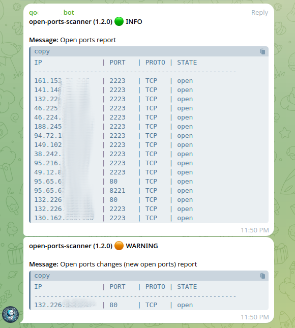

# open-ports-scanner


[](https://opensource.org/licenses/Apache-2.0)

[](https://hub.docker.com/repository/docker/vfabi/open-ports-scanner)


Open ports scanner application based on Nmap. Designed for periodic scanning of open ports with notifications in Telegram: it provides a report on all found open ports or only on changes (newly opened ports).  
Run in Kubernetes environment using CronJob, but can be run as a standalone docker application.



## Status

Production ready

## Features

- Periodic runs using Kubernetes CronJob.
- Scan specified ports using Nmap. Specified ports will be scanned as TCP and UDP.
- Configure the list of ports and targets for scanning through environment variables.
- Generate a report of open ports to standard output (stdout).
- Send report of open ports to Telegram.
- Detect changes in open ports (newly opened ports) and send a report to Telegram.

## Usage

### Environment variables

| Name | Type | Description | Mandatory | Default | Example |
| --- | --- | --- | --- | --- | --- |
| NMAP_TARGETS | str | Comma-separated Nmap targets (IP addresses or domains) to scan. | True | | `100.100.100.1,10.11.12.13,22.22.22.22` |
| NMAP_PORTS | str | Comma-separated Nmap ports to scan. Specified ports will be scanned as TCP and UDP. If not specified, it will scan top 1000 ports. | False | | `22,80,443` |
| SEND_REPORT_OPENPORTS_TELEGRAM | bool/str | Send open ports report to Telegram. | False | | `true` |
| SEND_REPORT_NEWOPENPORTS_TELEGRAM | bool/str | Send new open ports (changes) report to Telegram. | False | | `true` |
| TELEGRAM_BOT_TOKEN | str | Telegram bot token. Should be specified if `SEND_REPORT_OPENPORTS_TELEGRAM` or `SEND_REPORT_NEWOPENPORTS_TELEGRAM` is "true". | False* | | `1234567890:AABBCc1234567890nVoluqEOZXCzxc` |
| TELEGRAM_CHAT_ID_OPENPORTS_REPORT | str | Telegram chat ID for open ports report. Should be specified if `SEND_REPORT_OPENPORTS_TELEGRAM` is "true". | False* | | `-1234567890` |
| TELEGRAM_CHAT_ID_NEWOPENPORTS_REPORT | str | Telegram chat ID for new open ports report. Should be specified if `SEND_REPORT_NEWOPENPORTS_TELEGRAM` is "true". | False* | | `-234567891` |

### Docker environment

For a Docker environment, use the following commands:

```shell

# no ports specified
docker run --rm -it -v $(pwd)/data:/app/data -e NMAP_TARGETS="100.100.100.1,10.11.12.13,22.22.22.22" vfabi/open-ports-scanner:latest open-ports-scanner

# with ports specified
docker run --rm -it -v $(pwd)/data:/app/data -e NMAP_TARGETS="100.100.100.1,10.11.12.13,22.22.22.22" -e NMAP_PORTS="22,80,443" vfabi/open-ports-scanner:latest open-ports-scanner

# with telegram notifications, send only if there are open ports changes - new open ports report
docker run --rm -it -v $(pwd)/data:/app/data -e NMAP_TARGETS="100.100.100.1,10.11.12.13,22.22.22.22" -e NMAP_PORTS="22,80,443" -e SEND_REPORT_NEWOPENPORTS_TELEGRAM="true" -e TELEGRAM_BOT_TOKEN="1234567890:AABBCc1234567890nVoluqEOZXCzxc" -e TELEGRAM_CHAT_ID_NEWOPENPORTS_REPORT="-234567891" vfabi/open-ports-scanner:latest open-ports-scanner

# with telegram notifications, send open ports report and new open ports report
docker run --rm -it -v $(pwd)/data:/app/data -e NMAP_TARGETS="100.100.100.1,10.11.12.13,22.22.22.22" -e NMAP_PORTS="22,80,443" -e SEND_REPORT_NEWOPENPORTS_TELEGRAM="true" -e SEND_REPORT_OPENPORTS_TELEGRAM="true" -e TELEGRAM_BOT_TOKEN="1234567890:AABBCc1234567890nVoluqEOZXCzxc" -e TELEGRAM_CHAT_ID_OPENPORTS_REPORT="-1234567890" -e TELEGRAM_CHAT_ID_NEWOPENPORTS_REPORT="-234567891" vfabi/open-ports-scanner:latest open-ports-scanner
```

### Kubernetes environment

There are 2 options to deploy on Kubernetes:

1. Update and apply the yaml manifest at `deploy/kubernetes/yaml/main.yaml`
2. Update and apply the helm chart at `deploy/kubernetes/helm`

## Docker

[](https://hub.docker.com/repository/docker/vfabi/open-ports-scanner)  

## Build

Update docker image repository in `build.sh` and run it:

```shell
./build.sh
```

## Contributing

Please refer to each project's style and contribution guidelines for submitting patches and additions. In general, we follow the "fork-and-pull" Git workflow.

 1. **Fork** the repo on GitHub
 2. **Clone** the project to your own machine
 3. **Commit** changes to your own branch
 4. **Push** your work back up to your fork
 5. Submit a **Pull request** so that we can review your changes

NOTE: Be sure to merge the latest from "upstream" before making a pull request!

## License

Apache 2.0
